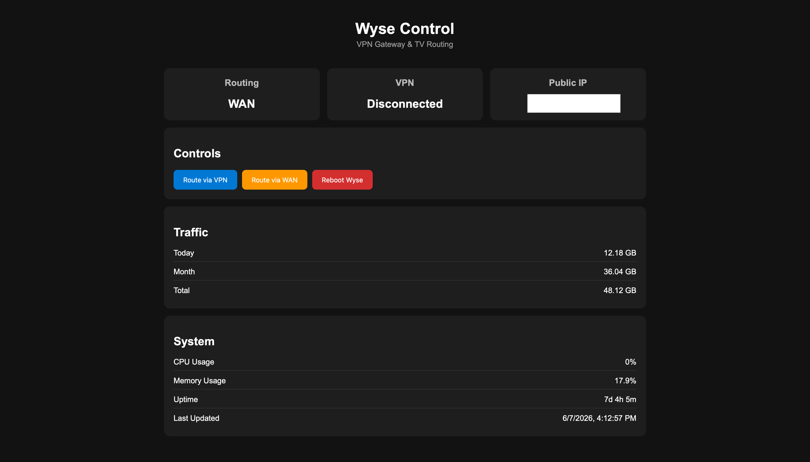

# WyseControl

A lightweight ASP.NET Core dashboard for managing a Debian-based Wyse thin client acting as a dedicated WireGuard VPN gateway.



## Why This Project Exists

LG WebOS TVs do not natively support WireGuard VPN clients and offer limited VPN capabilities.

This becomes a problem when:

* Accessing geo-restricted streaming services
* Accessing content libraries available only in specific countries
* Routing only the TV through a VPN without affecting the rest of the home network
* Using WireGuard instead of slower VPN alternatives

Typical solutions often involve:

* Configuring the entire router to use a VPN
* Purchasing dedicated VPN routers
* Sharing a VPN connection from a PC

These approaches either increase complexity or affect every device on the network.

WyseControl was created to provide a dedicated VPN gateway for a single TV while keeping the rest of the home network unchanged.

---

## Solution Overview

A Wyse thin client running Debian acts as an intermediate gateway between the TV and the main network.

The TV can be dynamically routed through:

### WAN Mode

```text
TV
 │
 ▼
Wyse
 │
 ▼
ER605
 │
 ▼
Internet
```

### VPN Mode

```text
TV
 │
 ▼
Wyse
 │
 ▼
WireGuard Tunnel
 │
 ▼
VPS
 │
 ▼
Internet
```

Routing can be switched instantly through a web dashboard.

---

## Network Topology

The setup used during development:

```text
Internet
    │
    ▼
ISP Router
    │
    ▼
TP-Link ER605
    │
    ├── Main LAN (VLAN 1)
    │       ├── PCs
    │       ├── Phones
    │       └── Other Devices
    │
    └── TV VLAN (VLAN 20)
            │
            ▼
       Wyse Thin Client
            │
            ▼
        LG WebOS TV
```

The TV resides in a dedicated VLAN connected to the Wyse gateway.

This allows the TV traffic to be independently routed through either the WAN connection or the WireGuard tunnel without impacting the rest of the network.

---

## Features

### VPN Management

* Enable WireGuard routing
* Disable WireGuard routing
* VPN status monitoring

### Traffic Monitoring

* Daily traffic usage
* Monthly traffic usage
* Total traffic usage

Powered by:

* vnStat

### System Monitoring

* Public IP
* Routing mode
* Memory usage
* CPU usage
* Uptime

### Device Management

* Remote Wyse reboot
* Real-time status updates

### Progressive Web App (PWA)

* Mobile friendly
* Installable on iPhone/iPad
* Standalone application mode
* Service Worker support

---

## Technology Stack

### Backend

* ASP.NET Core
* Minimal APIs
* C#

### Frontend

* HTML
* CSS
* JavaScript

### Infrastructure

* Debian Linux
* WireGuard
* iptables
* systemd
* vnStat

### Networking

* VLAN Segmentation
* Policy Routing
* NAT
* WireGuard Full Tunnel

---

## Hardware

### Gateway

* Dell Wyse Thin Client
* Debian Linux

### Network

* TP-Link ER605
* Dedicated VLAN for TV traffic

### Client

* LG WebOS TV

### VPN Endpoint

* Linux VPS
* WireGuard Server

---

## Dashboard

The dashboard provides:

* Routing Mode (WAN / VPN)
* VPN Status
* Public IP Address
* Traffic Statistics
* System Information
* One-click Routing Controls

---

## Screenshots

```text
docs/dashboard.png
```

---

## Installation

### Clone

```bash
git clone https://github.com/wobomau27/WyseControl.git
```

### Publish

```bash
dotnet publish \
-c Release \
-r linux-x64 \
--self-contained true
```

### Run

```bash
ASPNETCORE_URLS=http://0.0.0.0:5000 ./WyseControl
```

---

## systemd Service

Example:

```ini
[Unit]
Description=Wyse Control
After=network.target

[Service]
Type=simple
User=root
WorkingDirectory=/home/bruno/WyseControl
ExecStart=/home/bruno/WyseControl/WyseControl
Restart=always
RestartSec=5

Environment=ASPNETCORE_URLS=http://0.0.0.0:5000

[Install]
WantedBy=multi-user.target
```

---

## Future Improvements

* Native LG WebOS application
* Telegram notifications
* VPN watchdog
* Automatic VPN recovery
* Traffic graphs
* Multi-client support
* Multi-VPN support

---

## License

MIT License